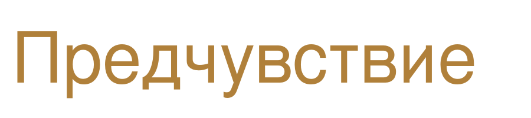

# Раздел «Манифест» — что сделать

## Шаг 1. Подготовить 4 файла

Положить в `media/`:

| Имя файла | Что это | Требования |
|---|---|---|
| `series-blue-name.png` | Рукописная надпись «BLUE ROOM» со стрелками | **прозрачный фон**, от 900 px по ширине |
| `series-blue.png` | Коллаж синей серии целиком | от 1400 px по ширине |
| `series-sepia-name.png` | Рукописная надпись «Предчувствие» | **прозрачный фон**, от 900 px по ширине |
| `series-sepia.png` | Коллаж серии «Предчувствие» | от 1400 px по ширине |

**Про коллажи.** Собери каждый в Canva как одну картинку — вместе с фотографиями, тайлами, блокнотом. Фон коллажа делай прозрачным или под цвет: слева сиреневый, справа тёплый бежевый. Ореолы вокруг рисует CSS, их в картинку класть не надо.

**Про надписи.** Только они должны быть с прозрачностью — иначе на цветном ореоле появится белый прямоугольник. Если Canva не даёт прозрачный PNG, вырезай через Photopea.

## Шаг 2. Подключить стиль

В `<head>`, после остальных:

```html
<link rel="stylesheet" href="css/manifesto.css?v=1">
```

Файл `manifesto.css` положить в `css/`.

## Шаг 3. Вставить разметку

Найди в `index.html` раздел `<section id="manifesto" ...>` и замени целиком:

```html
<section id="manifesto" class="section manifesto">
  <div class="manifesto-grid">

    <!-- ЛЕВАЯ СЕРИЯ -->
    <div class="series is-left" data-reveal="left" data-delay="200">
      <span class="series-label">Artwork series</span>
      
      
      <p class="series-question">
        Как бытовое пространство из интимного превращается в одиночество?
        Где начинается единение с собой? Когда ванная комната перестаёт
        быть обычной и повседневной?
      </p>
    </div>

    <!-- ЦЕНТР -->
    <div class="manifesto-center">
      <h2 class="manifesto-title" data-reveal="up">Artist<br>Statement</h2>

      <div class="manifesto-text">
        <p data-reveal="up" data-delay="120">
          В моей художественной практике я работаю с темой опыта переживания.
        </p>
        <p data-reveal="up" data-delay="220">
          Выбирая техники классической живописи и графики я обращаюсь
          к бытовым сюжетам, которые обостряю новым взглядом на привычные вещи.
        </p>
        <p data-reveal="up" data-delay="320">
          Большую роль в моих работах имеет текст, инсталляция, работа
          с целой серией. Мои интересы сосредоточены вокруг театрального
          жеста, анимационного движения, документальности гравюры.
        </p>
      </div>
    </div>

    <!-- ПРАВАЯ СЕРИЯ -->
    <div class="series is-right" data-reveal="right" data-delay="200">
      <span class="series-label">Серия работ</span>
      
      
      <p class="series-question">
        Записные книжки, обрывки фраз и осколки воспоминаний. Почему мы
        собираем физическую память? Что остаётся в конце от того,
        что мы увидели и запомнили?
      </p>
    </div>

  </div>
</section>
```

## Шаг 4. Проверить

```bash
cd ~/ma-cher-victoria
python3 -m http.server 5500
```

`http://localhost:5500/` — важно запускать из корня, не из `media`.

## Что крутить, если не так

| Что не нравится | Где править в `manifesto.css` |
|---|---|
| Ореолы слишком яркие | `.manifesto::before`, значения `.30` и `.22` |
| Заголовок мелкий или крупный | `.manifesto-title`, `clamp(38px, 6.5vw, 104px)` |
| Коллажи мало заходят за край | `.series.is-left`, множитель у `calc()` |
| Синий или охра не тот | `#4A46D6` и `#B0803A` |

## Шаг 5. Сжать после утверждения

```bash
cd ~/ma-cher-victoria
for f in media/series-*.png; do
  base="${f%.png}"
  magick "$f" -resize 1400x1400\> "$base-tmp.png"
  cwebp -q 86 "$base-tmp.png" -o "$base.webp"
  rm "$base-tmp.png"
done
```

Затем поменять в разметке `.png` на `.webp`. Надписи с прозрачностью WebP держит, прозрачность не потеряется.
